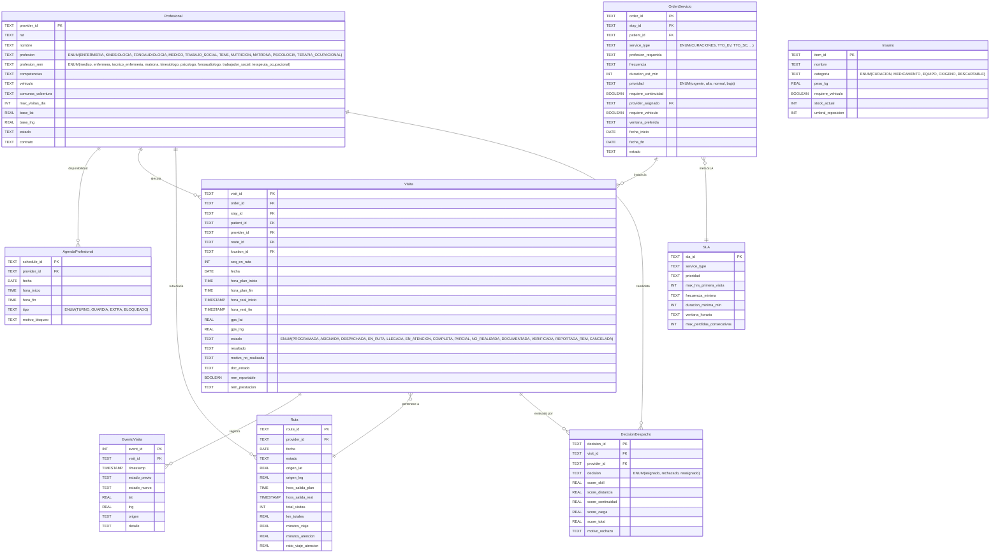
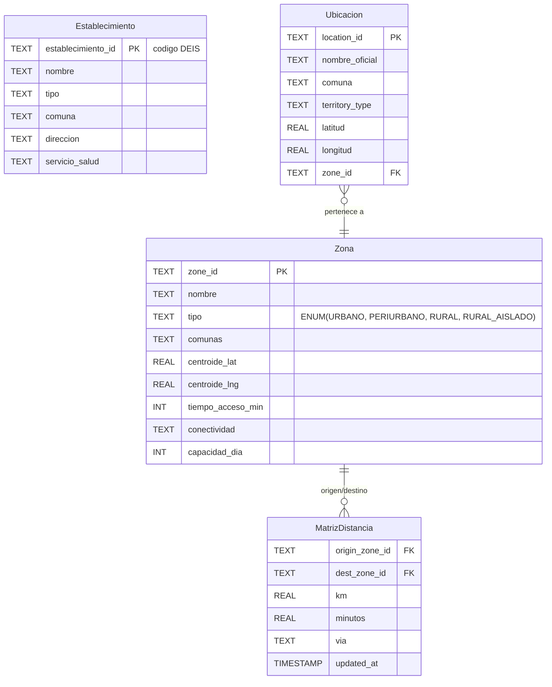
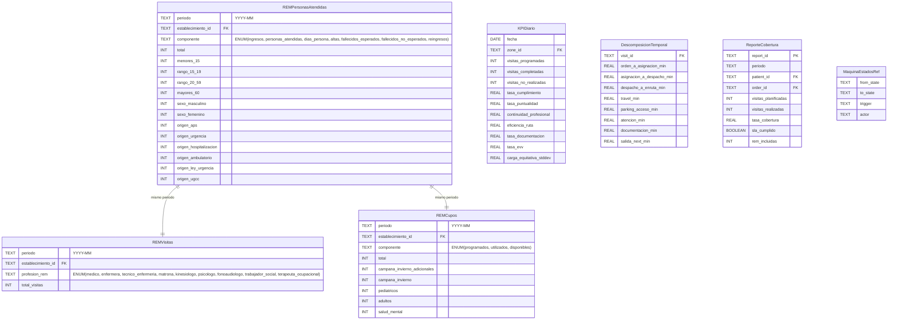
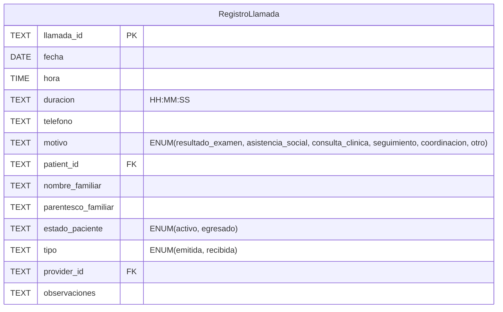
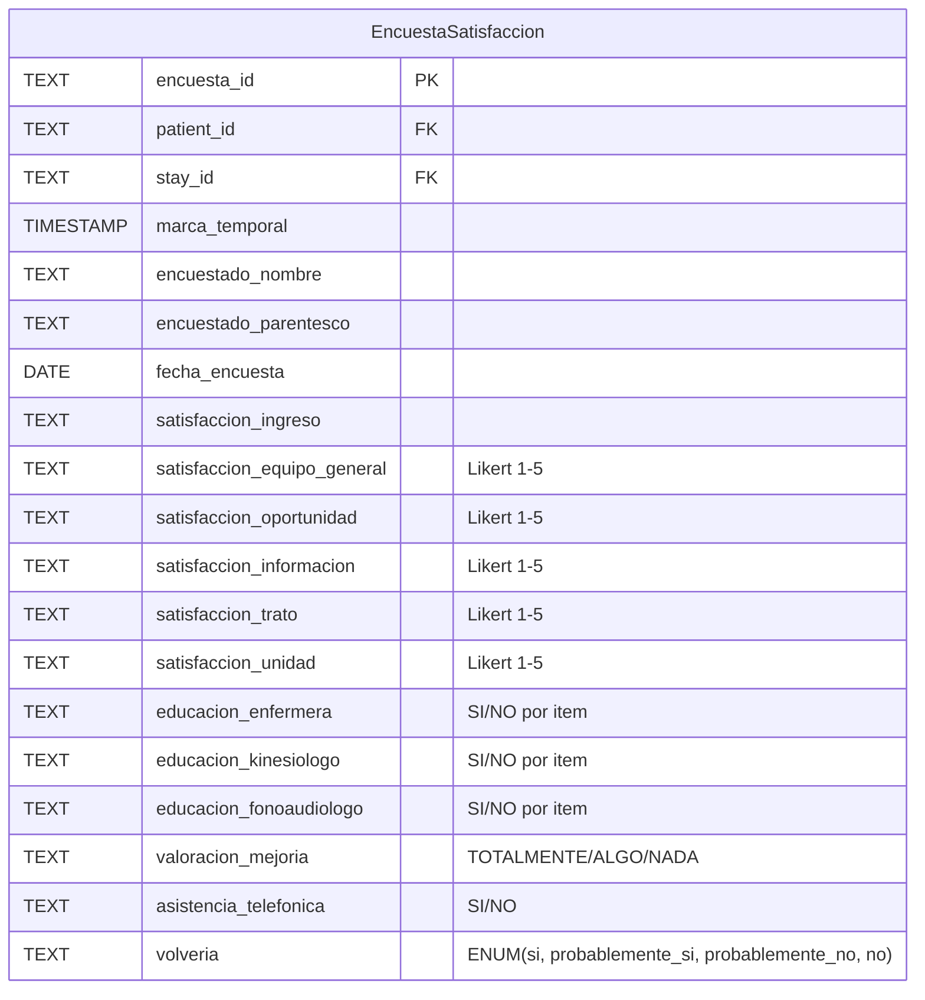
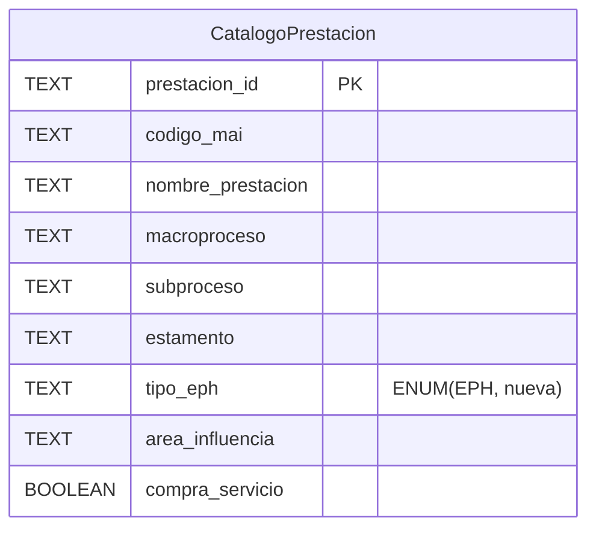

# Modelo Integrado HODOM — Componentes Autónomos

Fusión categórica de los modelos FHIR clínico, logística delivery y OPM ISO/PAS 19450,
con capa de reporte REM A21 C.1. Cada capa es autónoma y se compone
con las demás exclusivamente a través del contrato de identidad compartida.

```
Construcción: Grothendieck ∫F
Índice I:     {clínica, operacional, territorial, reporte}
Composición:  por identity keys compartidas (patient_id, stay_id, visit_id, ...)
Proveniencia: completa — cada campo trazable a FHIR, logística, OPM o REM
```

Fuentes integradas:
- ERD FHIR R4/R5 — Hospitalización Domiciliaria y Transporte (34 entidades)
- ERD Logística HODOM — Modelo Delivery Clínico (20 entidades)
- OPM HODOM v2.5 — ISO/PAS 19450 (SD–SD10, 7 procesos principales, 6 tipos egreso)
- Manual REM 2026, Serie A21 Sección C
- DS N° 1/2022, Reglamento HD
- Decreto Exento N° 31/2024, Norma Técnica HD

---

## Contrato de Integración

### Identity keys compartidas

| Key | Capa dueña | Consumidores | Formato |
|-----|-----------|--------------|---------|
| `patient_id` | Clínica | Operacional, Reporte | TEXT (hash determinista) |
| `stay_id` | Clínica | Operacional, Reporte | TEXT (hash determinista) |
| `visit_id` | Operacional | Clínica, Reporte | TEXT (hash determinista) |
| `provider_id` | Operacional | Clínica, Reporte | TEXT |
| `order_id` | Operacional | Clínica, Reporte | TEXT |
| `location_id` | Territorial | Clínica, Operacional | TEXT |
| `zone_id` | Territorial | Operacional, Reporte | TEXT |
| `establecimiento_id` | Territorial | Clínica, Reporte | TEXT (código DEIS) |

### Regla de propiedad

- Solo la capa dueña **crea y muta** una identity key.
- Las demás capas la referencian como foreign key de solo lectura.
- Si una capa necesita un ID que no existe, lo solicita a la capa dueña.

### Path equations inter-capa

```
PE-1  Visita(v).patient_id = Estadia(Visita(v).stay_id).patient_id
      "Una visita no puede apuntar a un paciente distinto al de su estadía"

PE-2  OrdenServicio(o).patient_id = Estadia(OrdenServicio(o).stay_id).patient_id
      "Ídem para órdenes de servicio"

PE-3  Visita(v).location_id → Ubicacion(loc).zone_id
      "Toda visita se resuelve a una zona territorial"

PE-4  REMPersonasAtendidas(periodo, establecimiento)
      = Σ Estadia WHERE periodo ∩ [fecha_ingreso, fecha_egreso] ≠ ∅
      "Las personas atendidas REM se derivan de estadías activas en el periodo"

PE-5  REMVisitas(periodo, profesion_rem)
      = count(Visita WHERE periodo ∧ rem_reportable = true)
      GROUP BY Profesional(Visita.provider_id).profesion_rem
      "Las visitas REM se derivan de visitas reportables agrupadas por profesión"
```

---

## Capa 1: Clínica

Propietaria de la identidad del paciente, las estadías y todo el contenido clínico.
Equivalencia FHIR directa para interoperabilidad futura.

```mermaid
erDiagram
    Paciente {
        TEXT patient_id PK
        TEXT nombre_completo
        TEXT rut
        TEXT sexo "ENUM(masculino, femenino)"
        DATE fecha_nacimiento
        TEXT direccion
        TEXT comuna
        TEXT cesfam
        TEXT prevision
        TEXT contacto_telefono
        TEXT estado_actual
    }
    Cuidador {
        TEXT cuidador_id PK
        TEXT patient_id FK
        TEXT nombre
        TEXT parentesco
        TEXT contacto
    }
    Estadia {
        TEXT stay_id PK
        TEXT patient_id FK
        TEXT establecimiento_id FK
        DATE fecha_ingreso
        DATE fecha_egreso
        TEXT estado "ENUM(activo, egresado, fallecido)"
        TEXT tipo_egreso "ENUM(alta_clinica, fallecido_esperado, fallecido_no_esperado, reingreso, renuncia_voluntaria, alta_disciplinaria)"
        TEXT origen_derivacion "ENUM(APS, urgencia, hospitalizacion, ambulatorio, ley_urgencia, UGCC)"
        TEXT diagnostico_principal
        TEXT confidence_level
        TEXT source_episode_ids
    }
    Condicion {
        TEXT condition_id PK
        TEXT stay_id FK
        TEXT codigo_cie10
        TEXT descripcion
        TEXT estado_clinico
        TEXT verificacion
    }
    PlanCuidado {
        TEXT plan_id PK
        TEXT stay_id FK
        TEXT estado
        DATE periodo_inicio
        DATE periodo_fin
    }
    RequerimientoCuidado {
        TEXT req_id PK
        TEXT plan_id FK
        TEXT tipo "ENUM(CURACIONES, TTO_EV, TTO_SC, TOMA_MUESTRAS, ELEMENTOS_INVASIVOS, CSV, EDUCACION, REQUERIMIENTO_O2, MANEJO_OSTOMIAS, USUARIO_O2)"
        TEXT valor_normalizado
        BOOLEAN activo
    }
    NecesidadProfesional {
        TEXT need_id PK
        TEXT plan_id FK
        TEXT profesion_requerida
        TEXT nivel_necesidad
    }
    Meta {
        TEXT meta_id PK
        TEXT plan_id FK
        TEXT descripcion
        TEXT estado_ciclo
    }
    Procedimiento {
        TEXT proc_id PK
        TEXT visit_id FK
        TEXT stay_id FK
        TEXT codigo
        TEXT descripcion
        TEXT estado
        TIMESTAMP realizado_en
    }
    Observacion {
        TEXT obs_id PK
        TEXT visit_id FK
        TEXT categoria
        TEXT codigo
        TEXT valor
        TEXT unidad
        TIMESTAMP efectivo_en
    }
    Medicacion {
        TEXT med_id PK
        TEXT stay_id FK
        TEXT visit_id FK
        TEXT medicamento_codigo
        TEXT medicamento_nombre
        TEXT via "ENUM(oral, IV, SC, IM, topica)"
        TEXT estado_cadena "ENUM(prescrita, dispensada, administrada)"
        TEXT dosis
    }
    Dispositivo {
        TEXT device_id PK
        TEXT patient_id FK
        TEXT tipo
        TEXT estado
        TEXT serial
        DATE asignado_desde
        DATE asignado_hasta
    }
    Documentacion {
        TEXT doc_id PK
        TEXT visit_id FK
        TEXT tipo "ENUM(nota_visita, informe_alta, consentimiento, foto_herida, evaluacion)"
        TEXT estado "ENUM(pendiente, completo, verificado)"
        TIMESTAMP fecha
    }
    Alerta {
        TEXT alerta_id PK
        TEXT patient_id FK
        TEXT stay_id FK
        TEXT categoria
        TEXT codigo
        TEXT estado
    }

    Paciente ||--o{ Estadia : "tiene"
    Paciente ||--o{ Cuidador : "asistido por"
    Paciente ||--o{ Dispositivo : "usa"
    Paciente ||--o{ Alerta : "tiene"
    Estadia ||--o{ Condicion : "diagnóstico"
    Estadia ||--o{ PlanCuidado : "plan"
    Estadia ||--o{ Medicacion : "medicación"
    Estadia ||--o{ Alerta : "alerta"
    PlanCuidado ||--o{ RequerimientoCuidado : "requiere"
    PlanCuidado ||--o{ NecesidadProfesional : "necesita"
    PlanCuidado ||--o{ Meta : "objetivo"
```



### Trazabilidad FHIR

| Entidad fusionada | Recurso FHIR R4 | Notas |
|---|---|---|
| Paciente | Patient | address[] = dirección domiciliaria |
| Cuidador | RelatedPerson | relationship = parentesco |
| Estadia | EpisodeOfCare | type = hospitalización domiciliaria |
| Condicion | Condition | code = CIE-10 |
| PlanCuidado | CarePlan | activity → RequerimientoCuidado |
| Meta | Goal | target = criterio de alta |
| Procedimiento | Procedure | Encounter-linked |
| Observacion | Observation | CSV, signos vitales, labs |
| Medicacion | MedicationRequest → Dispense → Administration | Cadena simplificada |
| Dispositivo | Device + DeviceUseStatement | Fusionados |
| Documentacion | Composition + DocumentReference | Fusionados |
| Alerta | Flag | Riesgo caída, mascota, acceso |

### Campos nuevos vs fuentes originales

| Campo | Entidad | Origen | Justificación |
|---|---|---|---|
| `tipo_egreso` | Estadia | **OPM SD1.6** | 6 tipos formalizados con condiciones. REM C.1.1 exige fallecido esperado/no esperado |
| `origen_derivacion` | Estadia | **OPM SD1.2** | XOR fan de 6 valores, confirmado por REM. Antes era texto libre |
| `renuncia_voluntaria` | Estadia.tipo_egreso | **OPM SD1.6** | 6to tipo de egreso faltante en versión anterior del modelo |
| `estado_cadena` | Medicacion | **NUEVO** | Traza lifecycle prescripción→administración |
| `cuidador_id` | Cuidador | **OPM SD1.1 + FHIR** | Precondición de elegibilidad: cuidador disponible requerido |
| `condicion_domicilio` | Estadia | **OPM SD7** | Precondición: servicios básicos, telefonía, acceso vial |

---

## Capa 2: Operacional

Propietaria de visitas, rutas, despacho y la ejecución del servicio.
Consume `patient_id` y `stay_id` de Clínica; `location_id` y `zone_id` de Territorial.



### Campo crítico: `profesion_rem`

El modelo operacional usa `profesion` (enum interno con 10 valores).
Para reportar REM C.1.2 se necesita `profesion_rem` (enum MINSAL con 9 valores).
El mapeo:

| profesion (interna) | profesion_rem (REM) |
|---|---|
| ENFERMERIA | enfermera |
| KINESIOLOGIA | kinesiologo |
| FONOAUDIOLOGIA | fonoaudiologo |
| MEDICO | medico |
| TRABAJO_SOCIAL | trabajador_social |
| TENS | tecnico_enfermeria |
| MATRONA | matrona |
| PSICOLOGIA | psicologo |
| TERAPIA_OCUPACIONAL | terapeuta_ocupacional |
| NUTRICION | *(no reportable REM C.1.2)* |

---

## Capa 3: Territorial

Propietaria de ubicaciones, zonas y la estructura geográfica.
Consumida por Clínica (establecimiento) y Operacional (zona de visita).



---

## Capa 4: Reporte

Propietaria de las estructuras de reporte REM y KPIs operacionales.
Consume IDs de las tres capas anteriores. **Materializada**, no derivada en caliente —
se genera por un proceso batch (potencial Stage 5 del pipeline).



### Reglas de derivación REM

```python
# REM C.1.1 — Personas Atendidas
# Se genera desde Capa Clínica (Estadia + Paciente)
for componente in [ingresos, personas_atendidas, dias_persona, altas,
                   fallecidos_esperados, fallecidos_no_esperados, reingresos]:
    SELECT
        periodo,
        establecimiento_id,
        componente,
        count(*) as total,
        count(*) FILTER (edad < 15)  as menores_15,
        count(*) FILTER (edad BETWEEN 15 AND 19) as rango_15_19,
        count(*) FILTER (edad BETWEEN 20 AND 59) as rango_20_59,
        count(*) FILTER (edad >= 60)  as mayores_60,
        count(*) FILTER (sexo = 'masculino') as sexo_masculino,
        count(*) FILTER (sexo = 'femenino')  as sexo_femenino,
        count(*) FILTER (origen_derivacion = 'APS') as origen_aps,
        -- ... etc para cada origen
    FROM Estadia JOIN Paciente USING (patient_id)
    WHERE <filtro por componente>
    GROUP BY periodo, establecimiento_id

# Mapeo componente → filtro:
#   ingresos            → fecha_ingreso IN periodo
#   personas_atendidas  → [fecha_ingreso, fecha_egreso] ∩ periodo ≠ ∅
#   dias_persona        → SUM(dias en periodo por paciente)
#   altas               → fecha_egreso IN periodo AND tipo_egreso IN ('alta_clinica', 'renuncia_voluntaria', 'alta_disciplinaria')
#   fallecidos_esperados    → tipo_egreso = 'fallecido_esperado' AND egreso IN periodo
#   fallecidos_no_esperados → tipo_egreso = 'fallecido_no_esperado' AND egreso IN periodo
#   reingresos          → tipo_egreso = 'reingreso' AND egreso IN periodo

# REM C.1.2 — Visitas
# Se genera desde Capa Operacional (Visita + Profesional)
SELECT
    periodo,
    establecimiento_id,   -- via Visita.location_id → Territorial
    Profesional.profesion_rem,
    count(*) as total_visitas
FROM Visita
JOIN Profesional USING (provider_id)
WHERE rem_reportable = true
GROUP BY periodo, establecimiento_id, profesion_rem

# REM C.1.3 — Cupos
# No derivable automáticamente — requiere input manual de capacidad instalada.
# La entidad REMCupos se alimenta de:
#   - programados: input manual (capacidad declarada)
#   - utilizados: count(DISTINCT patient_id) activos en periodo
#   - disponibles: programados - utilizados
```

### Reglas de consistencia REM (path equations de validación)

```
RC-1  total >= 0 (para todo campo numérico REM)

RC-2  REMPersonasAtendidas.total
      >= REMPersonasAtendidas.sexo_masculino + sexo_femenino
      (puede no cuadrar si hay registros incompletos)

RC-3  Σ(origen_*) = total por rango etario
      (regla de consistencia REM C.1.1 R.1)

RC-4  REMCupos.utilizados <= REMCupos.programados
      (regla REM C.1.3 R.1)

RC-5  REMCupos.disponibles = REMCupos.programados - REMCupos.utilizados
      (regla REM C.1.3 R.2)
```

---

## Diagrama de composición inter-capa

```
┌─────────────┐     patient_id      ┌──────────────────┐
│             │────────────────────▶│                  │
│  CLÍNICA    │     stay_id         │   OPERACIONAL    │
│             │────────────────────▶│                  │
│  Paciente   │                     │  Visita          │
│  Estadia    │◀────────────────────│  OrdenServicio   │
│  Condicion  │     visit_id        │  Profesional     │
│  PlanCuidado│                     │  Ruta            │
│  Medicacion │                     │  Despacho        │
│  Dispositivo│                     │  EventoVisita    │
│  ...        │                     │  ...             │
└──────┬──────┘                     └────────┬─────────┘
       │                                     │
       │ establecimiento_id                  │ zone_id, location_id
       │                                     │
       ▼                                     ▼
┌─────────────────────────────────────────────────────┐
│                    TERRITORIAL                       │
│  Establecimiento   Ubicacion   Zona   MatrizDistancia│
└──────────────────────────┬──────────────────────────┘
                           │
        patient_id, stay_id, visit_id, order_id,
        zone_id, establecimiento_id
                           │
                           ▼
┌─────────────────────────────────────────────────────┐
│                      REPORTE                         │
│  REMPersonasAtendidas  REMVisitas  REMCupos          │
│  KPIDiario  DescomposicionTemporal  ReporteCobertura │
└─────────────────────────────────────────────────────┘
```

---

## Integración OPM v2.5 — Contratos Comportamentales

El OPM (Object-Process Methodology, ISO/PAS 19450) aporta la dimensión **behavioral**
que los ERDs no capturan: lifecycles formales, precondiciones, postcondiciones y
máquinas de estado para cada proceso del dominio.

### Lifecycle principal (SD1)

```
Evaluar Elegibilidad → Ingresar Paciente → Planificar Atención
  → [Ejecutar Plan Terapéutico ⇄ Monitorear Evolución Clínica] (iterativo)
  → Egresar de HD → Seguimiento Post-Egreso
```

Este lifecycle se mapea al modelo estructural así:

| Proceso OPM | Entidades afectadas | Pre/Postcondiciones clave |
|---|---|---|
| Evaluar Elegibilidad (SD1.1) | Paciente, Cuidador, Estadia | PRE: prevision ∈ {fonasa-a..d, prais}, edad ≥ 18, distancia ≤ 20km, exclusiones = ausente, cuidador = disponible, domicilio = adecuado. POST: consentimiento firmado, elegibilidad = elegible |
| Ingresar Paciente (SD1.2) | Estadia, Documentacion | PRE: elegible + consentimiento firmado. POST: formulario ingreso, informe social, ficha clínica activa, origen_derivacion = exactamente 1 de 6 |
| Planificar Atención (SD1.3) | PlanCuidado, RequerimientoCuidado, NecesidadProfesional, Ruta | POST: plan terapéutico activo, plan enfermería activo, programa visitas, ruta transporte |
| Ejecutar Plan Terapéutico (SD1.4) | Visita, Observacion, Medicacion, Procedimiento | 10 subprocesos paralelos incluyendo logística diaria (SD1.4a) y entrega turno (SD1.4b) |
| Monitorear Evolución (SD1.5) | Observacion (12 signos vitales), Estadia | POST: categoría paciente ∈ {estable, mejorando, deteriorándose}, decisión continuidad |
| Egresar de HD (SD1.6) | Estadia | 6 tipos mutuamente excluyentes (ver abajo) |
| Seguimiento Post-Egreso (SD1.7) | Documentacion | POST: llamada seguimiento, contrarreferencia a APS, resultado egreso |

### 6 tipos de egreso (SD1.6) — mapeo a `tipo_egreso`

| OPM Process | `tipo_egreso` | Condición OPM | Documentos generados |
|---|---|---|---|
| Medical Discharging | `alta_clinica` | Condición Clínica → recuperado | Epicrisis, Encuesta Satisfacción |
| Hospital Readmission Discharging | `reingreso` | Inestabilidad Clínica Aguda = presente | Epicrisis |
| Expected Death Discharging | `fallecido_esperado` | Intención Paliativa = presente | Epicrisis, Protocolo Fallecimiento |
| Unexpected Death Discharging | `fallecido_no_esperado` | *(sin condición previa)* | Epicrisis, Protocolo Fallecimiento |
| Voluntary Withdrawal Discharging | `renuncia_voluntaria` | Consentimiento firmado | Epicrisis, Encuesta Satisfacción, Declaración Retiro |
| Disciplinary Discharging | `alta_disciplinaria` | Adherencia = no adherente | Epicrisis |

### Precondiciones de elegibilidad (SD1.1) — nuevos atributos

El OPM formaliza 5 precondiciones que hoy no se modelan como entidades/atributos:

| Precondición OPM | Propuesta de modelado | Capa |
|---|---|---|
| Insurance Status (fonasa-a..d, prais, other) | `Paciente.prevision` — ya existe, normalizar a enum OPM | Clínica |
| Patient Age (adulto, menor-de-edad) | Derivable de `Paciente.fecha_nacimiento` | Clínica |
| Hospital Distance (dentro/fuera cobertura) | Derivable de coordenadas paciente vs establecimiento | Territorial |
| Home Condition (adequate/inadequate) | **NUEVO**: `Estadia.condicion_domicilio` | Clínica |
| Exclusion Condition (5 tipos) | **NUEVO**: `Estadia.exclusiones_evaluadas` o checklist | Clínica |

### 12 signos vitales estandarizados (SD1.5)

El OPM define el catálogo exacto de variables que debe capturar `Observacion`:

```
presion_arterial, frecuencia_cardiaca, frecuencia_respiratoria,
saturacion_oxigeno, temperatura_corporal, glicemia,
escala_dolor, glasgow, estado_edema (absent|mild|moderate|severe),
diuresis, estado_intestinal,
estado_dispositivo_invasivo (none|present-normal|present-infected)
```

### Equipo de Salud (SD2) — roles no modelados

| Rol OPM | Estado en modelo integrado |
|---|---|
| Director Técnico | No modelado — rol de gobernanza, no ejecuta visitas |
| Profesional Coordinador / Gestora | No modelado — rol de gestión, no ejecuta visitas |
| Conductor | No modelado como Profesional — no reportable REM pero ejecuta rutas |
| Médico Regulador | Opcional en SD2, cubierto por Médico de Atención Directa en HSC |
| Matrona, Psicólogo, Terapeuta Ocupacional | "at least one other part" — colección incompleta |

Decisión de diseño: los roles de gobernanza (Director Técnico, Profesional Coordinador) y
transporte (Conductor) no se modelan como `Profesional` en la capa Operacional porque
no generan visitas reportables REM. Se documentan como constraint del sistema.

### Modo operacional (SD10)

El OPM modela un ciclo semanal que alterna entre:
- `full-weekday`: equipo completo, médico disponible
- `reduced-weekend`: solo enfermería, kinesiología, medicación

Esto se mapea a `AgendaProfesional.tipo` en la capa Operacional.
Los procesos que requieren médico (visita médica, fonoaudiología, decisión continuidad,
egreso por alta médica) se ejecutan solo en `full-weekday`.

### Gestión de Capacidad (SD6) — confirma REMCupos

El OPM modela `Installed Capacity` como atributo del sistema con exactamente los 7 slots
que REM C.1.3 exige:

```
Cupos Programados, Cupos Utilizados, Cupos Disponibles,
Cupos Campaña de Invierno, Cupos Salud Mental,
Cupos Adulto, Cupos Pediátrico
```

Esto confirma que `REMCupos` en la capa Reporte es correcto y que la fuente
es el proceso de gobernanza `Capacity Managing` (manejado por Profesional Coordinador).

### Catálogo de documentos (OPM → Documentacion.tipo)

El OPM cataloga 20+ tipos documentales producidos a lo largo del lifecycle.
El enum `Documentacion.tipo` se expande:

```
formulario_ingreso, informe_social_preliminar, informe_social,
registro_evaluacion_clinica, documento_indicaciones_cuidado,
registro_coordinacion_derivador, resumen_clinico_domiciliario,
epicrisis, encuesta_satisfaccion, protocolo_fallecimiento,
declaracion_retiro, registro_llamada_seguimiento,
resultado_egreso, registro_curacion, registro_fonoaudiologia,
registro_telesalud, registro_llamada, registro_movimientos,
registro_entrega_turno, reporte_ejecucion_rutas,
carta_derechos_deberes, consentimiento_informado
```

---

## Auditoría del Corpus Legacy (`documentacion-legacy/drive-hodom`)

Análisis exhaustivo de 2661 archivos en el Drive HODOM para determinar qué información
debe migrar al modelo integrado y qué entidades nuevas se requieren.

### Inventario por tipo de archivo

| Tipo | Cantidad | Naturaleza |
|------|----------|------------|
| PDF | 2024 | Epicrisis adjuntas a formularios (1956), epicrisis antiguas (47), material educativo (17), estadísticas (4) |
| DOCX | 513 | Epicrisis enfermería (~280), entregas de turno (~130), registros diarios (~90), formularios/protocolos (~13) |
| XLSX/XLSM | 71 | Programación, rutas, formularios, estadísticas, llamadas, satisfacción, canasta, REM |
| JPEG | 49 | Fotos de curaciones organizadas por paciente |
| KMZ | 1 | Mapa Google Earth con ubicaciones de pacientes |

### Clasificación categórica de las fuentes

#### Fuentes → Capa Clínica

| Fuente legacy | Entidad destino | Campos extraíbles | Volumen |
|---|---|---|---|
| `Copia de FORMULARIO HODOM HSC (respuestas).xlsx` | Paciente, Estadia | 23 columnas: marca temporal, nombres, apellidos, RUT, fecha_nacimiento, edad, sexo, servicio_origen (UE/MEDICINA/CIRUGÍA/TMT), diagnóstico, dirección, CESFAM, celulares, COVID, aislamiento, prestación solicitada (multi-valor), previsión (FONASA A-D), gestora, epicrisis adjunta | 1224 registros |
| `FORMULARIO 2026 RESP (respuestas).xlsx` | Paciente, Estadia | 17 columnas simplificadas: +USUARIO_O2, +GESTORA_ENCARGADA, -COVID, apellidos consolidados | 147 registros |
| `resp antiguo.xlsx` | Paciente, Estadia | 23 columnas: dirección granular (sector/calle/nro/referencias/comuna), 3 celulares, sin fecha_nacimiento ni diagnóstico | 47 registros |
| `HODOM 2025/FECHAS DE NACIMIENTO.xlsx` | Paciente, Estadia | fecha_ingreso, fecha_egreso, RUT, nombre, fecha_nacimiento, edad, dirección, teléfono, diagnóstico, comuna, estado | ~200 registros |
| `EPICRISIS ENFERMERIA/*.docx` (~280) | Documentacion, Estadia, Medicacion, Dispositivo | Epicrisis estructurada: datos paciente, diagnóstico, resumen cuidados, medicamentos, dispositivos, fecha alta | ~280 pacientes |
| `Formulario sin título/DAU -- EPICRISIS/*.pdf` (~1850) | Documentacion | Epicrisis/DAU adjuntas desde Google Forms | ~1850 documentos |
| `EPICRISIS ANTIGUAS/*.pdf` (~47) | Documentacion | Epicrisis históricas | ~47 documentos |
| `CURACIONES/*.jpeg` (~49) | Documentacion (tipo=foto_herida) | Fotos de heridas organizadas por paciente + fecha | ~49 imágenes |
| `RESPUESTA SATISFACCIÓN USUARIA.xlsx` | **EncuestaSatisfaccion** (NUEVA) | 45 columnas: datos encuestado, paciente, fechas, escalas Likert por profesional, valoración global | 33 respuestas |
| `Hoja de derivación.docx` | Documentacion (tipo=hoja_derivacion) | Formulario de derivación desde establecimiento | template |
| `EDUCACIONES/CI hodom.docx` | Documentacion (tipo=consentimiento_informado) | Consentimiento informado | template |

#### Fuentes → Capa Operacional

| Fuente legacy | Entidad destino | Campos extraíbles | Volumen |
|---|---|---|---|
| `PROGRAMACIÓN 2026.xlsx` (y 2025) | Visita, OrdenServicio | Matriz paciente×día con códigos de actividad (CA, CS, KTM, VM, NTP, FONO, EXAMENES, etc.) | ~30 pacientes × 30 días × 12 meses |
| `RUTAS/` (2024: 12, 2025: 12, 2026: 4) | Visita, Ruta | Schema universal 11 col: conductor, hora, 5 columnas profesionales (MEDICO/FONO/KINE/ENFERMERA/TENS), paciente, código servicio, dirección, teléfono. 1 hoja/día, ~18-30 visitas/día | ~28 archivos mensuales, ~800 hojas |
| `HODOM 2023/_Equipos y Rutas.xlsm` | Visita, Ruta, Profesional | patente vehículo, conductor, hora, fecha, equipo asignado (por columna: fono, médico, enfermería, kine, T.social, TENS), motivo, destino-comuna, paciente, teléfono | ~2400 filas (jun-dic 2023) |
| `LLAMADAS/REGISTRO LLAMADAS.xlsx` | **RegistroLlamada** (NUEVA) | fecha, hora, duración, teléfono, motivo, paciente, familiar, estado (activo/egresado), tipo (emitida/recibida), profesional, observaciones. 7 hojas mensuales (jul-ene). Motivos: ASISTENCIA SOCIAL, RESULTADO EX, CONSULTA CLÍNICA, SEGUIMIENTO, COORDINACIÓN | ~6000+ registros (jul 2024 - ene 2025) |
| `ENTREGA TURNO/*.docx` (~130) | EventoVisita, Documentacion | Entregas de turno diarias con snapshot de pacientes activos | ~130 documentos (ago 2023 - abr 2026) |
| `ENTREGA KINE/Ent. Turno Hodom KINE.xlsx` | EventoVisita | Entrega de turno específica kinesiología | 1 archivo |
| `ESTADÍSTICAS POR PROFESIONAL/` | Profesional, Visita | Estadísticas mensuales individuales por enfermera, kine, fono, T.social, TENS | ~20 archivos |
| `CANASTA/CANASTA HODOM.xlsx` | **CatalogoPrestacion** (NUEVA) | usuario, macroproceso, subproceso, estamento, prestación, código MAI | 23 prestaciones |

#### Fuentes → Capa Territorial

| Fuente legacy | Entidad destino | Campos extraíbles |
|---|---|---|
| `DATOS ESTADÍSTICOS/Hodom HSC.kmz` | Ubicacion | Coordenadas GPS de domicilios de pacientes |

#### Fuentes → Capa Reporte

| Fuente legacy | Entidad destino | Campos extraíbles | Volumen |
|---|---|---|---|
| `HODOM 2023/REM JULIO.xlsx` | REMPersonasAtendidas, REMVisitas, REMCupos, CatalogoPrestacion | REM A21 C.1 + REM BS. Hoja Rem A21: ingresos, personas atendidas, días persona, altas, fallecidos, reingresos × (edad, origen, sexo); visitas × profesión; cupos × tipo. Hoja Rem BS: códigos día-cama (0201501 básico $39.400, 0201502 medio $60.290, 0201503 alta complejidad $100.420) | REM mensual real |
| `DATOS ESTADÍSTICOS/Consolidado atenciones diarias.xlsx` | REMVisitas, KPIDiario | fecha, enfermero, kinesiologo, fonoaudiologo, medico, tecnico — conteo diario | ~365 filas (2026) |
| `HODOM 2023/prestaciones julio.xlsx` | REMVisitas | Prestaciones del mes | 1 archivo |
| `HODOM 2023/INFORME GESTION CAMAS.xlsx` | REMCupos | Gestión de camas/cupos | 1 archivo |

### Vocabulario controlado descubierto: Códigos de Actividad

La PROGRAMACIÓN usa códigos abreviados en las celdas de la matriz paciente×día.
Estos códigos son la fuente de verdad para `OrdenServicio.service_type` y `Visita.rem_prestacion`:

| Código | Significado | Mapeo a model | Profesión REM |
|---|---|---|---|
| CA | Curación Avanzada | CURACIONES | enfermera |
| CS | Curación Simple | CURACIONES | enfermera |
| KTM | Kinesiología Motora | KINESIOLOGIA | kinesiologo |
| KTR | Kinesiología Respiratoria | KINESIOLOGIA | kinesiologo |
| VM | Visita Médica | VISITA_MEDICA | medico |
| NTP / NPT | Nutrición Parenteral Total | TTO_EV | enfermera |
| TTO EV | Tratamiento Endovenoso | TTO_EV | enfermera |
| TTO SC | Tratamiento Subcutáneo | TTO_SC | enfermera |
| FONO | Fonoaudiología | FONOAUDIOLOGIA | fonoaudiologo |
| EXAMENES | Toma de muestras | TOMA_MUESTRAS | enfermera / tecnico |
| RETIRO | Retiro de equipamiento (NTP, vía venosa) | *(evento, no prestación)* | enfermera |
| ALTA HODOM | Alta del programa | *(evento de egreso)* | — |
| EGRESO | Egreso | *(evento de egreso)* | — |
| $ | Marcador (posible facturación/cierre) | *(metadata)* | — |
| ERTA | Ciclo de tratamiento antibiótico | TTO_EV | enfermera |

### Entidades nuevas requeridas

El corpus legacy revela 4 entidades que el modelo integrado no contempla:

#### 1. RegistroLlamada (Capa Operacional)



Justificación: ~1000+ registros en `LLAMADAS/REGISTRO LLAMADAS.xlsx` con esquema consistente
en hojas mensuales (sep 2024 - ene 2025). Corresponde al proceso OPM `Remote Care Regulating`
(SD1.4) que genera `Call Record` y `Telehealth Record`, y a `Follow-Up Call Executing` (SD1.7).
FHIR mapping: `Communication` resource.

#### 2. EncuestaSatisfaccion (Capa Clínica)



Justificación: 33 respuestas en `RESPUESTA SATISFACCIÓN USUARIA.xlsx` (45 columnas).
Corresponde al proceso OPM SD1.6 `Medical Discharging yields Satisfaction Survey` y
`Voluntary Withdrawal Discharging yields Satisfaction Survey`.
FHIR mapping: `QuestionnaireResponse`.

#### 3. CatalogoPrestacion (Capa Territorial — referencia)



Justificación: 23 prestaciones en `CANASTA/CANASTA HODOM.xlsx` con códigos MAI
(Modalidad de Atención Institucional). Es el catálogo de lo que HODOM puede facturar/reportar.
Vincula `Procedimiento.codigo` y `OrdenServicio.service_type` con el sistema nacional de prestaciones.
No tiene par FHIR directo (closest: `ActivityDefinition` o `ChargeItemDefinition`).

#### 4. ActividadProgramada (Capa Operacional — denormalizada a Visita)

No requiere entidad propia — se absorbe como atributo en la relación Visita↔OrdenServicio.
La PROGRAMACIÓN (matriz paciente×día) es una **vista denormalizada** de:

```
ActividadProgramada(paciente, fecha, código_actividad)
  = Visita(visit_id) WHERE Visita.patient_id = paciente
    AND Visita.fecha = fecha
    AND OrdenServicio(Visita.order_id).service_type = código_actividad
```

Path equation: `∀ celda(p, d, c) en PROGRAMACIÓN: ∃ Visita v tal que
v.patient_id = p ∧ v.fecha = d ∧ OrdenServicio(v.order_id).service_type ∈ decode(c)`

### Vocabulario controlado: Servicio Origen (formularios → origen_derivacion REM)

Los formularios Google usan `SERVICIO ORIGEN SOLICITUD` con valores operacionales
que deben mapearse al enum REM `origen_derivacion`:

| Valor formulario | Frecuencia (HSC) | Mapeo a origen_derivacion REM |
|---|---|---|
| UE (Unidad de Emergencia) | 21 | `urgencia` |
| MEDICINA | 15 | `hospitalizacion` |
| CIRUGÍA | 6 | `hospitalizacion` |
| TMT (Traumatología) | 3 | `hospitalizacion` |
| *(no presente)* | — | `APS` |
| *(no presente)* | — | `ambulatorio` |
| *(no presente)* | — | `ley_urgencia` |
| *(no presente)* | — | `UGCC` |

Nota: Los formularios legacy no capturan derivaciones desde APS, ambulatorio,
ley de urgencia ni UGCC. Esto explica por qué el REM julio 2023 muestra solo
`Urgencia` (8) y `Hospitalización` (10) como orígenes.

### Vocabulario controlado: Previsión (formularios → elegibilidad OPM SD1.1)

| Valor formulario | Frecuencia | Mapeo OPM Insurance Status |
|---|---|---|
| FONASA A | 5 | `fonasa-a` |
| FONASA B | 39 | `fonasa-b` |
| FONASA C | 3 | `fonasa-c` |
| FONASA D | — | `fonasa-d` |
| PRAIS | — | `prais` |

### Vocabulario controlado: Clasificación de Heridas (epicrisis enfermería)

Descubierto en el template de epicrisis. Enriquece `Procedimiento` y `Observacion`:

| Campo | Valores |
|---|---|
| Tipo herida | QUIRÚRGICA, PIE DIABÉTICO, ÚLCERA VENOSA, LPP, ARTERIAL, MIXTA, DESCONOCIDA |
| Grado LPP | I, II, III, IV |
| Dispositivos invasivos | VVP (vía venosa periférica), SNG (sonda nasogástrica), CUP (catéter urinario permanente), DRENAJES |
| Ostomías | sí/no + localización |

### Path equations nuevas (inter-capa, legacy-derived)

```
PE-6  RegistroLlamada(l).patient_id → Paciente(p) ∧
      RegistroLlamada(l).provider_id → Profesional(pr)
      "Toda llamada vincula paciente y profesional"

PE-7  EncuestaSatisfaccion(e).stay_id → Estadia(s) ∧
      Estadia(s).tipo_egreso ∈ {alta_clinica, renuncia_voluntaria}
      "Solo se aplica encuesta en altas médicas y renuncias voluntarias (OPM SD1.6)"

PE-8  Procedimiento(p).codigo → CatalogoPrestacion(c).codigo_mai
      "Todo procedimiento registrado debe tener código MAI válido"

PE-9  Σ(Visita | fecha=d ∧ profesion_rem=X)
      = ConsolidadoAtencionesDiarias(d, X)
      "El consolidado diario es la agregación de visitas por profesión"

PE-10 RegistroLlamada(l).estado_paciente = 'activo'
      ↔ ∃ Estadia(s) WHERE s.patient_id = l.patient_id
        ∧ s.fecha_egreso IS NULL
      "El estado activo/egresado de la llamada debe ser consistente con las estadías"
```

### Documentos narrativos: estrategia de migración

| Tipo documental | Cantidad | Estrategia | Datos extraíbles |
|---|---|---|---|
| Epicrisis Enfermería (docx) | ~280 | Parsear template → Documentacion + campos clínicos | nombre, edad, RUT, CESFAM, fecha ingreso/egreso, diagnóstico médico, heridas (tipo: quirúrgica/pie_diabético/úlcera_venosa/LPP/arterial/mixta, localización, grado LPP, tamaño, tejido, exudado, apósitos), dispositivos invasivos (VVP/SNG/CUP/DRENAJES: sí/no), ostomías, alergias, plan enfermería, derivación APS |
| Epicrisis/DAU (PDF) | ~1900 | Indexar como Documentacion (sin parsing profundo) | nombre paciente (del filename), tipo documento |
| Entrega Turno (docx) | ~130 | Indexar como Documentacion con fecha | fecha, snapshot de pacientes activos |
| Registro Diario (docx) | ~90 | Extraer censo diario → KPIDiario retroactivo | fecha, pacientes activos, conteo |
| Fotos Curaciones (jpeg) | ~49 | Indexar como Documentacion.tipo=foto_herida | paciente (del directorio), fecha (del filename) |
| Protocolos/Templates | ~10 | Referencia — no migran como datos | — |
| Informes gestión | ~5 | Referencia histórica — no migran | — |

### Diagrama de composición actualizado con legacy

```
                    ┌─────────────────────────┐
                    │   LEGACY DRIVE HODOM     │
                    │   (2661 archivos)        │
                    └───────┬─────────────────┘
                            │
          ┌─────────────────┼──────────────────┐
          ▼                 ▼                  ▼
┌─────────────┐   ┌──────────────────┐  ┌──────────────┐
│  CLÍNICA    │   │   OPERACIONAL    │  │  TERRITORIAL │
│  +Encuesta  │   │   +Llamada       │  │  +Catálogo   │
│   Satisf.   │   │   +Vocab.Activ.  │  │   Prestación │
│             │   │                  │  │              │
└──────┬──────┘   └────────┬─────────┘  └──────┬───────┘
       │                   │                   │
       └───────────────────┼───────────────────┘
                           ▼
                 ┌─────────────────────┐
                 │      REPORTE        │
                 │  REM real validado  │
                 │  Consolidado diario │
                 └─────────────────────┘
```

---

## Functor Information Loss

| Transformación | Pérdida |
|---|---|
| FHIR → Capa Clínica | `CareTeam` absorbido en PlanCuidado (no es entidad separada); `HealthcareService` absorbido en Establecimiento; `PlanDefinition`/`ActivityDefinition` absorbidos en RequerimientoCuidado |
| Logística → Capa Operacional | Analogías delivery (Uber/DoorDash) descartadas — son documentación, no estructura |
| OPM → Modelo integrado | Roles de gobernanza (Director Técnico, Profesional Coordinador) no se materializan como entidades — son constraints del sistema. Conductor no es Profesional en el sentido REM. Infraestructura física (SD3, SD4, SD5) no se modela como entidades de datos — son precondiciones ambientales |
| Ambos → Capa Reporte | Dimensiones REM no son cruzadas (no permite edad × sexo) — limitación del formato MINSAL, no del modelo |
| Capa Clínica → CSV pipeline | `Condicion` como entidad separada (hoy es atributo plano `diagnostico_principal`); `Medicacion` como cadena (hoy no existe) |
| Legacy → Modelo integrado | Narrativa no estructurada de ~130 entregas de turno y ~90 registros diarios se pierde (solo se indexa como Documentacion, no se parsea). Fotos de curaciones (~49) pierden el contexto clínico (tipo herida, estadio, superficie) — solo se preserva paciente + fecha. Informes de gestión (~5 docx) no migran |

---

## Riesgos

1. **`tipo_egreso` no tiene fuente actual.** Ni SGH ni los formularios exportan este campo con la granularidad requerida (6 valores OPM). Requiere captura manual o nuevo campo en el formulario de egreso. Sin esto, REM C.1.1 fallecidos sigue siendo irreportable. El OPM formaliza condiciones para cada tipo (intención paliativa, inestabilidad clínica, adherencia) que podrían informar la captura.

2. **`origen_derivacion` requiere mapeo.** El campo `servicio_origen` actual es texto libre. El OPM SD1.2 confirma los 6 valores como XOR fan mutuamente excluyente. Candidato para `input/manual/origen_derivacion_mapping.csv`.

3. **Cupos es input manual puro.** Confirmado por OPM SD6 como proceso de gobernanza (`Capacity Managing`). No derivable del pipeline — la capacidad instalada depende de decisiones del Profesional Coordinador. Requiere un formulario mensual o entrada en el admin dashboard.

4. **Profesiones incompletas.** El OPM SD2 confirma: matrona, psicólogo y terapeuta ocupacional están en la colección incompleta ("at least one other part"). En HSC pueden no existir como dotación permanente. Si existen pero no están modelados, hay subreporte REM.

5. **Stage 5 no existe.** La capa Reporte asume un proceso de materialización que hoy no está implementado. Sería un `scripts/build_hodom_rem_report.py` que consume canonical + operacional → CSVs REM.

6. **Precondiciones de elegibilidad no capturadas.** El OPM SD1.1 formaliza 5 precondiciones (previsión, edad, distancia, condición domicilio, exclusiones) que hoy no se registran estructuralmente. La ausencia de `condicion_domicilio` y `exclusiones_evaluadas` impide auditar rechazos de ingreso.

7. **Contratos comportamentales no validados por pipeline.** El lifecycle OPM define un orden estricto (elegibilidad → ingreso → planificación → ejecución → monitoreo → egreso → seguimiento). El pipeline actual no valida que las estadías pasen por estos estados en orden. Las path equations de la capa Reporte asumen datos correctos pero no hay enforcement.

## Siguientes pasos pragmáticos

### Fase 1: Correcciones al pipeline actual (Stage 4)
1. Agregar `tipo_egreso` (6 valores) y `origen_derivacion` (6 valores) a `hospitalization_stay.csv`.
2. Crear mapeo `servicio_origen` → `origen_derivacion` REM en `input/manual/`.
3. Crear `input/reference/catalogo_prestacion_mai.csv` desde `CANASTA/CANASTA HODOM.xlsx` (23 prestaciones con código MAI).
4. Crear `input/reference/vocabulario_actividad.csv` con los 15 códigos de actividad de la PROGRAMACIÓN.

### Fase 2: Migración de datos legacy
5. Migrar `FORMULARIO HODOM HSC (respuestas).xlsx` y `FORMULARIO 2026 RESP (respuestas).xlsx` → alimentar Stage 1/2 como fuente adicional (form_rescued).
6. Migrar `RUTAS/` (28 archivos mensuales 2024-2026) → generar `visita_legacy.csv` con visitas ejecutadas.
7. Migrar `Equipos y Rutas HODOM 2023.xlsm` → generar `visita_legacy_2023.csv` + `ruta_legacy_2023.csv`.
8. Migrar `LLAMADAS/REGISTRO LLAMADAS.xlsx` → generar `registro_llamada.csv` (nueva entidad).
9. Migrar `RESPUESTA SATISFACCIÓN USUARIA.xlsx` → generar `encuesta_satisfaccion.csv` (nueva entidad).
10. Indexar `EPICRISIS ENFERMERIA/*.docx` → generar `documento_legacy.csv` (tipo, paciente, fecha).
11. Migrar `Consolidado atenciones diarias.xlsx` → validar contra conteos derivados del pipeline.

### Fase 3: Capa Reporte (Stage 5)
12. Implementar `scripts/build_hodom_rem_report.py` que genere `rem_personas_atendidas.csv`, `rem_visitas.csv`, `rem_cupos.csv`.
13. Crear `input/manual/cupos_mensuales.csv` para captura de capacidad instalada.
14. Validar REM generado contra `HODOM 2023/REM JULIO.xlsx` como caso de prueba.

### Fase 4: Enriquecimiento clínico
15. Validar profesiones activas en HODOM San Carlos contra tabla REM C.1.2 y OPM SD2.
16. Agregar `condicion_domicilio` y checklist de exclusiones a la evaluación de elegibilidad.
17. Definir los 12 códigos de signos vitales OPM como catálogo fijo para `Observacion.codigo`.
18. Parsear template de epicrisis enfermería para extraer campos estructurados (medicamentos, dispositivos, diagnóstico de egreso).

---

## Signature Categórica

```
Construcción:    Grothendieck ∫F sobre I = {clínica, operacional, territorial, reporte}
Fuentes:         FHIR R4/R5 (34 ent.) ⊔ Logística Delivery (20 ent.) ⊔ OPM v2.5 (SD–SD10) ⊔ Legacy Drive (2661 archivos)
Entidades:       32 (29 base + 3 nuevas legacy: RegistroLlamada, EncuestaSatisfaccion, CatalogoPrestacion)
Identity keys:   8 (patient_id, stay_id, visit_id, provider_id, order_id, location_id, zone_id, establecimiento_id)
Path equations:  10 (PE-1..PE-5 inter-capa + PE-6..PE-10 legacy-derived)
Vocabularios:    5 (códigos actividad ×15, servicio origen ×4→6, previsión ×5, clasificación heridas ×7, profesion_rem ×9)
Migración:       Sigma (fusión con pérdida aceptada en narrativa no estructurada)
Proveniencia:    completa por campo
```
